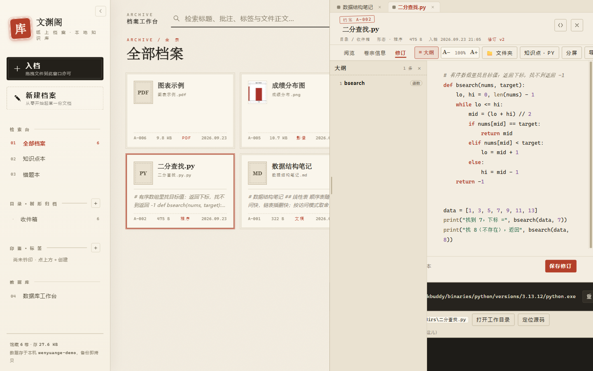
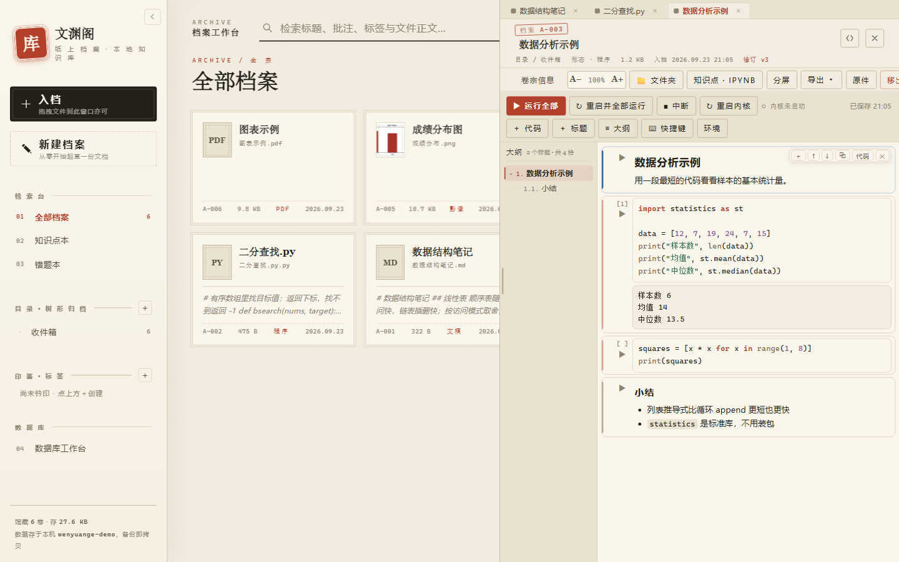
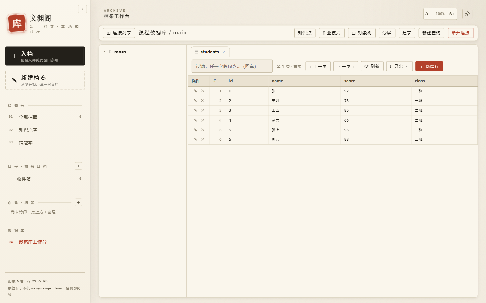

# 聚文坞 FileDock · 官网

[简体中文](#简体中文) · [English](#english)

---

## 简体中文

**文档、表格、幻灯片、PDF、图片、代码、笔记本、数据库 —— 装进同一个界面的 Windows 桌面知识库。**

不用在十几个软件之间来回倒腾：档案放进来就能读、能改、能跑、能查、能导出。所有资料留在你自己的电脑上，
不注册、不联网同步、不锁定你放进来的东西。

### 界面一览

#### 档案工作台 —— 五十余种格式，放进来看见就能读

左侧是**档案列表**（按「钤印标签 / 卷册 / 最近入档」归类）；右侧是**阅览栏**：Markdown 与富文本按原样排版。
文本与代码档案左侧还有一道**「≡ 大纲」**，按标题自动分级编号（`##` → `1.1`，其下 `###` → `1.1.1`），点一下正文就跳到那一节；
代码档案认的是 `def` / `class` / `CREATE TABLE` 这类定义行，后面还标着是函数、类还是表。

#### 代码运行 —— 落笔即见其果

选中解释器按一下「▶ 运行」，结果就在下方。关键字彩色、缩进、**按 Tab 唤起补全**（导包后的包内成员、你自己定义过的名字都会列出来）。
出错一律**译成中文**：第几行第几列、什么毛病、该怎么改；原始英文报错折叠备查。

#### 笔记本（`.ipynb`）—— 像 Jupyter 一样一格一格写

单格运行、格间共享变量，**输出与插图留在格子里**。Jupyter 那套快捷键都在（`a` `b` `dd` `x` `c` `v` `z`、`Enter` / `Esc`、`m` / `y`），
而且**点开就是一张键位表，每一条都能自己改绑**（和数据库那一套用法一致）。
运行按钮只在**选中 / 编辑中**那一格才浮现，一屏不乱；格前那道短竖条会报状态：**蓝 = 选中，绿 = 编辑中**；侧边大纲只列标题、自动编号、可折叠。

#### 表格编辑 —— 就地改，不用导出再用别的软件开

单元格直接改，行列随时增删；长内容自动撑高，不会憋在一条窄缝里。「阅览 / 修订」两个标签随时对照，改完即存。

#### 数据库工作台 —— 直接把库连进知识库

支持 **MySQL / MariaDB、PostgreSQL、SQL Server、SQLite**，内嵌终端还能 SSH 远连服务器。
左侧是连接与表树，点开就是数据；写 SQL 时结果直接以表格呈现。
库房报错同样**译成中文并在 SQL 里标出出错位置**；`FROM students s` 之后敲 `s.`，会列出这张表的**真实列名**。

### 功能详解

#### 一、什么都能装进来

- **五十余种格式自动识认**，无需另装插件：文档（`docx` `doc` `md` `txt` `rtf` …）、表格（`xlsx` `xls` `csv` …）、
  幻灯片（`pptx`）、`pdf`、图片（`png` `jpg` `gif` `webp` `svg` …）、代码（`py` `js` `ts` `go` `rs` `c` `cpp` `java` `sql` …）、
  网页（`html`）、数据（`json` `yaml` `xml`）等。
- **三种归档视图**：钤印标签 / 卷册（文件夹）/ 最近入档 —— 千册档案也能顷刻寻见。
- **检索直通正文与批注**：记得住一句话、却忘了它在哪一卷，也翻得出来。
- **草稿箱**：还没想好归到哪儿的，先扔进去。
- **多文件工程**：一份 HTML 档案可以带上自己的 CSS / JS / 图片（编辑栏的「📎 附属文件」），预览时相对路径自动找到。
- **附件**：给档案挂上配套文件，删除档案时一并清走。

#### 二、阅览：打开就能读

- **文本 / 文档**：Markdown 与富文本按原样渲染；文本类档案默认给「文档」视图，另留「源码」按钮。
- **侧边大纲（≡ 大纲）**：Markdown 的 `#` 标题自动分级编号（`##` → `1.1`，其下 `###` → `1.1.1`）；
  代码档案认 `def` / `class` / `function` / `CREATE TABLE` 这类定义行并标注「函数 / 类 / 表」。**点一下跳过去**。
- **表格**：只读预览保留列宽、表头吸附，长表横竖都能滚。
- **幻灯片、PDF、图片、影音**：PDF 逐页翻、图片可缩放、影音直接在界面里放。
- **思维导图与单页 HTML**：HTML 档案可以带交互（自己的 JS 照常跑）。
- **多卷并陈**：同时开多份，拖拽调版式、可分屏对读、并行校订。

#### 三、编辑：原地改，不用导出再导入

- **富文本**：标题、粗斜体、列表、引用、代码块、表格。
- **代码**：关键字彩色、缩进、Tab 缩进；**补全**认得这门语言的关键字与内置名、对象成员，
  以及**本文件里已经出现过的名字**；导包后按别名也能补（`import math as mm` → `mm.` 出 `sqrt` / `pi`）。
  补全两种模式：默认**敲字即弹**，也可以在设置里开「安静模式」只按 `Tab` 才补。
- **表格编辑器**：改单元格、增删行列；单元格是文本框，长内容自动撑高。
- **查找替换**：`Ctrl+F` 通篇查找，命中处全部点亮、逐处跳转；文本、表格、导图都能定位。
- **划词翻译**：选中一段就地译，不用切窗口。
- **版本**：档案的修订是版本化写入的，改坏了能回退。

#### 四、代码运行：落笔即见其果

- **二十余种解释器与编译器**可直接调用：Python、Node.js、C / C++、Go、Rust、Java、PHP、Ruby、Lua、SQL …
  用系统里已有的就行，也可以只装便携版自带的那套。
- **报错译成中文**：指出第几行第几列、什么毛病、该怎么改；原始英文报错退到折叠里备查。
  常见的坑（全角标点、缩进、括号不配对、表名拼错）会直接点名。
- **每个代码档案一个固定工作目录**：源码、**你放进去给脚本读的数据文件**、脚本生成的结果全都在一起，
  相对路径 `open("data.txt")` 真的能读到；跑完不删。
- **产物有交代**：运行结果区会给出工作目录的绝对路径，以及「打开工作目录 / 定位源码」两个入口，
  并列出本次生成的文件（同时自动入档到同一个知识库）。
- **支持标准输入**：需要输入的脚本在运行面板里直接敲。

#### 五、笔记本（`.ipynb`）

- 打开 `.ipynb` 就是笔记本：一格一格写、**单独运行某一格**、格间共享变量，输出与插图留在格子里。
- **Jupyter 那套快捷键，且可查看、可改绑**：`a` 上方插格、`b` 下方插格、`dd` 删除、`x` 剪切、`c` 复制、`v` 粘贴、
  `z` 撤销单元格操作、`Enter` 进编辑、`Esc` 回命令态、`m` / `y` 切标题格与代码格、`Shift+Enter` 运行并下移。
  工具条上的「⌨ 快捷键」点开是**弹窗式键位表**（按命令态 / 编辑态分组），**每条右边都有组合键框、点一下按新键即可改绑**，
  可解绑、可一键恢复默认，改动跨重启生效。
  格前那道短竖条会报状态：**蓝色 = 选中，绿色 = 正在编辑**；**运行按钮只在选中或编辑中的那一格浮现**，一屏最多一个。
- **侧边大纲只列标题**，自动编号、可折叠、点一下跳过去，滚到哪一节高亮哪一节。
- **格子里也能划词**：选中一段代码，浮条上就能「＋ 知识点 / ＋ 错题本 / 译」，右键也有「翻译」——记笔记、翻译不用先复制出去。
- 内核常驻（一格一格的变量是连着的），支持中断长时间运行的格子；重启内核后状态立刻回到「内核就绪」，代码格高度贴住内容不拖空行。

#### 六、数据库工作台

- **直连四种库**：MySQL / MariaDB、PostgreSQL、SQL Server、SQLite；**内嵌终端还能 SSH 远连服务器**。
- **看表数据**：左侧树形列出库 / 表 / 字段，点开就是数据，翻页、筛选、排序。
- **写 SQL**：查询结果直接以表格呈现；`FROM students s` 之后敲 `s.` 会列出**这张表的真实列名**。
- **报错也是中文**：并在 SQL 里标出出错的位置 —— 表名拼错、列不存在、约束冲突一眼看清。
- **导出**：查询结果与表数据可导出成表格文件。
- **作业模式**：把一份文书摊在左侧并读，右侧连着数据库写作业，不必在窗口之间来回翻找。

#### 七、知识点本与错题本

- **知识点本**：按分类攒知识点，写东西时随时开小窗查（小窗浮在内容之上、互不遮挡）。
- **错题本**：错题带着重做与复习；**SQL 类错题可以指定「在哪运行」**（选连接 + 选库），
  运行就在那个库里真跑，结果按表格回来；下次重做这道题会自动记住当时的库。
- 作答支持跑代码 / 跑 SQL，报错同样中文化。

#### 八、导出与打印

- 文本与文档导出 PDF / HTML / 纯文本；表格导出 `xlsx` / `csv`；图片按原格式另存。
- 导出与下载都写在你指定的目录，**不经浏览器**（不会出现"下完找不到文件"）。

#### 九、便携版（免安装）

- 解压即用：**自带 Python 3.13**（含 `numpy` / `pandas` / `matplotlib` / `openpyxl` / `requests`）与**中文字体**，
  插到没装过任何环境的 Windows 电脑上，编程功能照样可用。
- **资料跟着 U 盘走**：所有档案与设置在解压出来的文件夹里，换台电脑插上就接着用。
- 想用电脑上自己的 Anaconda 也行，在设置里指定即可；留空就用自带的。
- 便携版**不参与自动更新**，升级请换一个新的便携包。

#### 十、数据与隐私

- **纯本地**：档案、设置、数据库连接信息都在你指定的数据目录（默认在用户目录，安装时可改到 D 盘等位置）。
- **数据库密码本机加密**（aes-256-gcm）后才落盘。
- 联网行为只有两件：检查更新（读官网的清单文件），以及你主动使用的划词翻译。**没有账号，也没有遥测。**

### 下载

| 版本 | 说明 | 文件 |
|---|---|---|
| **安装版 `1.7.7`** | 双击安装，自动检查更新 | [Releases](https://github.com/lp000-l/docbase-site/releases/latest) · `FileDock-Setup-1.7.7.exe` |
| **便携版 `1.7.7`** | 解压即用 · 自带 Python · 资料跟着 U 盘走 | [Releases](https://github.com/lp000-l/docbase-site/releases/latest) · `FileDock-Portable-1.7.7.zip` |

- 校验码（SHA-256）在官网下载区与[便携版专页](https://lp000-l.github.io/docbase-site/portable.html)都有列出。
- 安装包会自动检查更新；**便携版不参与自动更新**。

### 环境要求

- Windows 10 / 11（64 位）
- 安装版约 114 MB；便携版压缩包约 230 MB，解压后约 583 MB
- Python / Node.js 等解释器可以用系统里已经装好的；只想跑代码不想配环境，就用便携版自带的那套

### 常见问题

**Q：和 Obsidian / Notion / Joplin 有什么不一样？**
它们围绕「笔记」；聚文坞围绕「档案」—— 你原来就有的 `docx` / `xlsx` / `pptx` / `pdf` / 代码 / 图片直接放进来就能用，
不用先导入成私有格式，也不用担心迁移不出来。

**Q：会不会把我电脑上的文件搬走或改掉？**
不会。档案是复制进知识库的，原文件不动；删除档案只影响知识库里的那一份。

**Q：内存和磁盘占用大吗？**
软件本身是个 Electron 桌面程序，空闲时占用与浏览器一个标签页相当；磁盘只放你自己的档案。

**Q：为什么浏览器下载按钮提示"有风险"？**
这是 Windows 对未购买代码签名证书的程序的通用提示，不是报错。校验 SHA-256 与官网一致即可放心。

**Q：下载很慢或者断了怎么办？**
官网的下载按钮是多线程分片下载，断了会续；也可以在 [Releases](https://github.com/lp000-l/docbase-site/releases) 里直接下。

### 链接

- **官网**：<https://bishe.xin/>
- **本站镜像**：<https://lp000-l.github.io/docbase-site/>
- **更新手记**：<https://bishe.xin/journal.html>
- **反馈与建议**：<https://bishe.xin/feedback.html>

### 关于本仓库

本站是 **聚文坞 FileDock 官网的 GitHub Pages 镜像**，内容由发布脚本从同一份源文件自动生成，**请勿手动修改本仓库**。

- 镜像上做了四处改写：下载按钮指向本仓库的 Releases；反馈表单仍提交到官网接口（会进同一个后台）；
  每个页面页脚注明「本站为镜像站」；主页标了 `mirror-of`。
- 正式站点永远以 <https://bishe.xin/> 为准。当前镜像版本：`1.7.7`（2026 年 9 月 25 日 更新）。

> 聚文坞 FileDock · 本站由发布脚本自动生成，勿手改。

---

## English

**Documents, spreadsheets, slides, PDFs, images, code, notebooks and databases — a Windows desktop knowledge base that puts them all behind one interface.**

No more juggling a dozen applications. Drop a file in and you can read it, edit it, run it, query it and export it. Everything stays on your own computer — no account, no cloud sync, no lock-in on the files you put in.

### A look at the interface

#### Archive workbench — 50+ formats, open and read

On the left is the **archive list**, organised by tag, folder or most-recently-added. On the right is the **reading pane**, where Markdown and rich text are typeset as intended.
Text and code archives also get an **outline panel** that numbers headings by level (`##` → `1.1`, `###` beneath it → `1.1.1`) and jumps the body to the section you click. For code, it recognises definition lines such as `def`, `class` and `CREATE TABLE`, and labels each entry as a function, class or table.

#### Running code — write it, watch it run

Pick an interpreter, press **Run**, and the output appears below. Syntax colouring, indentation and **Tab-triggered completion** that knows your imported package members and every name you have defined in the file.
Every error is **explained in plain language** — which line and column, what went wrong, how to fix it — with the original traceback folded away for reference.

#### Notebooks (`.ipynb`) — cell by cell, like Jupyter

Run a single cell, share variables between cells, and keep **outputs and figures inside the cell**. All the familiar Jupyter shortcuts are there (`a` `b` `dd` `x` `c` `v` `z`, `Enter` / `Esc`, `m` / `y`) — and **one click opens a keymap where every binding can be reassigned** (the same mechanism the database workspace uses).
The run button only appears on the **selected or editing** cell, so the screen stays clean. The short bar beside each cell reports its state: **blue = selected, green = editing**. The sidebar outline lists headings only, numbers them automatically and collapses.

#### Spreadsheet editing — edit in place, no export round-trip

Edit cells directly, add or remove rows and columns at will, and let long content grow the cell instead of trapping it in a sliver. Flip between the **Read** and **Edit** tabs to compare, and changes are saved as you go.

#### Database workspace — wire a database straight into your knowledge base

Supports **MySQL / MariaDB, PostgreSQL, SQL Server and SQLite**, with an embedded terminal that can tunnel to a remote server over SSH.
The tree on the left lists connections, tables and columns — click through to the data. Write SQL and the results come back as a table.
Database errors are likewise **explained in plain language with the failing position highlighted in your SQL**. Type `s.` after `FROM students s` and it lists **the real column names of that table**.

### Feature detail

#### 1. Bring anything in

- **Over fifty formats recognised automatically**, with no plugins to install: documents (`docx` `doc` `md` `txt` `rtf` …), spreadsheets (`xlsx` `xls` `csv` …), slides (`pptx`), `pdf`, images (`png` `jpg` `gif` `webp` `svg` …), code (`py` `js` `ts` `go` `rs` `c` `cpp` `java` `sql` …), web pages (`html`), data (`json` `yaml` `xml`) and more.
- **Three archive views**: by tag, by folder, or most recently added — thousands of files stay findable.
- **Search reaches into bodies and annotations**: if you remember a sentence but not which volume it lives in, you can still find it.
- **Drafts box**: toss in anything you have not decided where to file yet.
- **Multi-file projects**: an HTML archive can carry its own CSS, JS and images (via **Attached files** in the editor), and relative paths resolve automatically during preview.
- **Attachments**: hang companion files off an archive; deleting the archive takes them with it.

#### 2. Reading: open it and read

- **Text and documents**: Markdown and rich text render as intended. Plain-text archives default to the document view, with a source view one click away.
- **Outline panel**: Markdown headings are numbered by level (`##` → `1.1`, `###` beneath it → `1.1.1`). For code, definition lines such as `def`, `class`, `function` and `CREATE TABLE` are recognised and labelled. **Click to jump.**
- **Spreadsheets**: read-only preview keeps column widths and pins the header row; long sheets scroll both ways.
- **Slides, PDFs, images, audio and video**: page through PDFs, zoom images, play media right in the interface.
- **Mind maps and single-page HTML**: HTML archives can be interactive — their own JavaScript still runs.
- **Many volumes side by side**: open several at once, drag to rearrange, split the view for side-by-side reading and parallel editing.

#### 3. Editing: change it in place

- **Rich text**: headings, bold and italic, lists, quotes, code blocks, tables.
- **Code**: syntax colouring, indentation and Tab indentation. **Completion** knows the language keywords, built-ins and object members, plus **every name already used in the file**. Aliased imports work too (`import math as mm` → `mm.` offers `sqrt` and `pi`). Two completion modes: pop up as you type by default, or switch on **quiet mode** in settings so only `Tab` triggers it.
- **Spreadsheet editor**: edit cells, add or remove rows and columns; cells are text boxes that grow with long content.
- **Find and replace**: `Ctrl+F` searches the whole document, highlights every hit and steps through them — in text, spreadsheets and mind maps alike.
- **Translate a selection**: select a passage and translate it in place, without switching windows.
- **Versions**: revisions are written as versions, so a bad edit can be rolled back.

#### 4. Running code: write it, watch it run

- **Twenty-plus interpreters and compilers** are available directly: Python, Node.js, C / C++, Go, Rust, Java, PHP, Ruby, Lua, SQL and more. Use whatever is already installed on your system — or just the set bundled with the portable edition.
- **Errors explained in plain language**: which line and column, what went wrong, how to fix it; the original text is folded away for reference. Common traps (full-width punctuation, indentation, unbalanced brackets, misspelled table names) are called out by name.
- **Each code archive gets a fixed working directory**: your source, **the data files you drop in for the script to read**, and everything the script produces all live together, so a relative `open("data.txt")` really does find the file. Nothing is cleaned up afterwards.
- **The output is accounted for**: the results pane shows the absolute path of the working directory, offers **Open working directory** and **Reveal source** actions, and lists the files produced this run (which are also filed into the same knowledge base automatically).
- **Standard input supported**: type into the run panel when a script needs input.

#### 5. Notebooks (`.ipynb`)

- Open a `.ipynb` and you get a notebook: write cell by cell, **run a single cell**, share variables between cells, and keep outputs and figures inside the cells.
- **The familiar Jupyter shortcuts, viewable and reassignable**: `a` insert above, `b` insert below, `dd` delete, `x` cut, `c` copy, `v` paste, `z` undo a cell operation, `Enter` to edit, `Esc` back to command mode, `m` / `y` to switch between markdown and code, `Shift+Enter` to run and move down. **Shortcuts** in the toolbar opens a **keymap dialog** grouped by command mode and edit mode, where **each row has a binding box: click it and press the new combination**. Bindings can be cleared and restored to defaults, and changes survive a restart. The short bar beside each cell reports its state (**blue = selected, green = editing**), and **the run button only appears on the selected or editing cell** — one at most per screen.
- **The sidebar outline lists headings only**, numbers them, collapses, and highlights whichever section you have scrolled to.
- **Select text inside a cell**: highlight a passage and the floating bar offers **add to knowledge notes / add to mistakes / translate**; right-click has Translate too — so note-taking and translation do not require copying text out first.
- The kernel stays resident, so variables persist from cell to cell; long-running cells can be interrupted. After a kernel restart the status returns to ready immediately, and code cells hug their content without leaving blank lines.

#### 6. Database workspace

- **Connect directly to four kinds of database**: MySQL / MariaDB, PostgreSQL, SQL Server and SQLite — plus **an embedded terminal that can tunnel to a remote server over SSH**.
- **Browse table data**: the left-hand tree lists databases, tables and columns; click through to the data and page, filter and sort it.
- **Write SQL**: results come back as a table. Typing `s.` after `FROM students s` lists **the real column names of that table**.
- **Errors in plain language too**, with the failing position highlighted in your SQL — a misspelled table, a missing column or a constraint conflict is obvious at a glance.
- **Export**: query results and table data can be exported as spreadsheet files.
- **Homework mode**: spread a document out on the left, write against a live database on the right — no window shuffling.

#### 7. Knowledge notes and mistakes notebook

- **Knowledge notes**: collect notes by category and pull them up in a small floating window while you write, without covering your work.
- **Mistakes notebook**: retry and review mistakes. **SQL mistakes can specify where to run** (connection plus database); the query really runs in that database and comes back as a table, and retrying the question later remembers which database you used.
- Answers can run code or SQL, with the same plain-language error handling.

#### 8. Export and printing

- Text and documents export to PDF, HTML or plain text; spreadsheets to `xlsx` or `csv`; images are saved in their original format.
- Exports and downloads are written to the directory you choose, **without going through the browser** — so a download never silently vanishes.

#### 9. Portable edition (no installation)

- Unzip and run: **Python 3.13 is bundled** (with `numpy`, `pandas`, `matplotlib`, `openpyxl` and `requests`) along with **CJK fonts**, so the coding features work on a Windows machine with no environment set up at all.
- **Your material travels on the USB stick**: every archive and setting lives inside the extracted folder, so moving to another computer is just a matter of plugging it in.
- Prefer your own Anaconda install? Point to it in settings; leave it blank to use the bundled one.
- The portable edition **does not participate in automatic updates** — to upgrade, download a fresh portable package.

#### 10. Data and privacy

- **Entirely local**: archives, settings and database connection details all live in the data directory you choose (your user folder by default; you can point it at another drive during installation).
- **Database passwords are encrypted on this machine** (aes-256-gcm) before being written to disk.
- Only two things touch the network: checking for updates (reading the manifest on the official site) and translation, which you invoke yourself. **No account, no telemetry.**

### Download

| Edition | Description | Files |
|---|---|---|
| **Installer `1.7.7`** | Double-click to install; checks for updates automatically | [Releases](https://github.com/lp000-l/docbase-site/releases/latest) · `FileDock-Setup-1.7.7.exe` |
| **Portable `1.7.7`** | Unzip and run · Python bundled · your material travels with the drive | [Releases](https://github.com/lp000-l/docbase-site/releases/latest) · `FileDock-Portable-1.7.7.zip` |

- SHA-256 checksums are published in the download section of the official site and on the [portable edition page](https://lp000-l.github.io/docbase-site/portable.html).
- The installer checks for updates automatically; **the portable edition does not**.

### Requirements

- Windows 10 / 11 (64-bit)
- Installer is about 114 MB; the portable package is about 230 MB compressed and about 583 MB extracted
- Python, Node.js and other interpreters can be the ones already installed on your system — if you just want to run code without setting anything up, use the bundled set in the portable edition

### FAQ

**Q: How is this different from Obsidian / Notion / Joplin?**
They are built around *notes*; FileDock is built around *files*. The `docx`, `xlsx`, `pptx`, `pdf`, code and images you already have can simply be dropped in — no importing into a proprietary format first, and no worry about being unable to get them back out.

**Q: Will it move or modify files on my computer?**
No. Files are copied into the knowledge base; the originals are untouched. Deleting an archive only affects the copy inside the knowledge base.

**Q: Does it use much memory or disk space?**
It is an Electron desktop application, so at rest it uses roughly as much as a browser tab, and on disk it only holds the archives you put in.

**Q: Why does the browser warn that the download is risky?**
That is Windows' standard warning for applications without a purchased code-signing certificate — not an error. Verify that the SHA-256 matches the official site and you are safe.

**Q: What if the download is slow or gets interrupted?**
The download buttons on the official site use multi-threaded ranged downloads that resume after an interruption. You can also download directly from [Releases](https://github.com/lp000-l/docbase-site/releases).

### Links

- **Official site**: <https://bishe.xin/>
- **This mirror**: <https://lp000-l.github.io/docbase-site/>
- **Release notes**: <https://bishe.xin/journal.html>
- **Feedback**: <https://bishe.xin/feedback.html>

### About this repository

This site is the **GitHub Pages mirror of the FileDock official website**. Its contents are generated by the release script from the same source files — **please do not edit this repository by hand.**

- Four changes are applied to the mirror: download buttons point at this repository's Releases; the feedback form still posts to the official site's endpoint (landing in the same backend); every page footer notes that this is a mirror; and the home page carries a `mirror-of` tag.
- The official site at <https://bishe.xin/> is always authoritative. Current mirror version: `1.7.7` (updated 2026 年 9 月 25 日).

> 聚文坞 FileDock — generated by the release script; do not edit by hand.